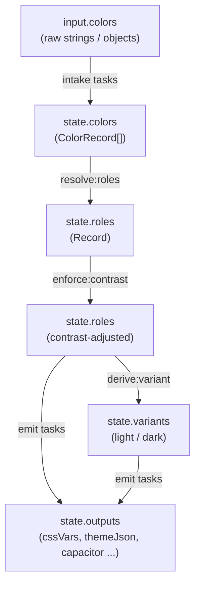

# How the pipeline works

iridis is a task pipeline. You register primitives and tasks, declare an execution order, pass an input, and get a fully resolved palette out. The engine does not know or care what the pipeline contains, that is your configuration.

::: tip Live builder
The example panel on the right is running this exact pipeline against your seeds. Open the **Role schema** or **Code** tab to see how the structure maps to what you're reading below. Every page on the docs uses the same builder.
:::

## The four stages

Every useful iridis pipeline passes through four conceptual stages, even though the task names are explicit and the order is yours to define:

```
intake → resolve → enforce → emit
```

**Intake** tasks (`intake:hex`, `intake:rgb`, `intake:hsl`, `intake:oklch`, `intake:lab`, `intake:named`, `intake:imagePixels`, `intake:any`) read `input.colors` and append parsed `ColorRecord` objects to `state.colors`. `intake:any` dispatches to all format-specific handlers automatically and is the recommended default.

**Resolve** tasks (`resolve:roles`, `expand:family`) assign colors to named semantic roles. `resolve:roles` matches colors to roles by hint or OKLCH distance. `expand:family` derives roles that have a `derivedFrom` reference, applying lightness and chroma range offsets from the source role. Together they turn a flat list of `ColorRecord` values into a keyed `state.roles` map.

**Enforce** tasks (`enforce:contrast`, `enforce:wcagAA`, `enforce:wcagAAA`, `enforce:apca`, `enforce:cvdSimulate`) walk the `contrastPairs` declared in your role schema and nudge foreground colors until each pair meets its `minRatio`. The core `enforce:contrast` task is algorithm-agnostic; the contrast plugin provides opinionated WCAG/APCA variants.

**Emit** tasks write consumer-shaped output into `state.outputs`. Each plugin brings its own emitters. `emit:cssVars` writes a stylesheet block; `emit:vscodeThemeJson` assembles a complete VS Code theme JSON; `emit:capacitorStatusBar` writes native chrome parameters. You list only the emitters you need.

## The data flow



## TaskRegistry, the spine

`TaskRegistry` (`packages/core/src/registry/TaskRegistry.ts`) is a `Map<string, TaskInterface>`. Every task has a string `name` (e.g. `'intake:any'`). `register(task)` stores it. `resolve(name)` retrieves it and throws if absent.

```ts
import { TaskRegistry } from '@studnicky/iridis';

const registry = new TaskRegistry();
registry.register(myCustomTask);
registry.has('my:custom');          // true
registry.resolve('my:custom');      // TaskInterface
```

The `Engine` owns one `TaskRegistry` instance (`engine.tasks`). When you call `engine.pipeline(['intake:any', 'resolve:roles', ...])`, the engine validates that every name is registered before storing the order. Tasks execute in the declared order during `engine.run()`.

`TaskRegistry` also supports lifecycle hooks via `registry.hook(phase, task)`. Phase `'onRunStart'` runs before the pipeline sequence; `'onRunEnd'` runs after. Plugins can use hooks to initialize or flush state without occupying a pipeline slot.

## Plugins, domain modules

A plugin is any object that satisfies `PluginInterface`:

```ts
interface PluginInterface {
  readonly name:    string;
  readonly version: string;
  tasks(): readonly TaskInterface[];
  math():  readonly MathPrimitiveInterface[];
}
```

`engine.adopt(plugin)` registers all of the plugin's tasks and math primitives in one call. iridis ships seven plugins in addition to the core task set: `@studnicky/iridis-vscode`, `@studnicky/iridis-stylesheet`, `@studnicky/iridis-tailwind`, `@studnicky/iridis-image`, `@studnicky/iridis-contrast`, `@studnicky/iridis-capacitor`, and `@studnicky/iridis-rdf`. Each is a separate package; install only what your project needs.

A plugin is an object with `name`, `version`, `tasks()`, and `math()`. Implement the interface and export a singleton:

```ts
import type { PluginInterface } from '@studnicky/iridis';

export const myPlugin: PluginInterface = {
  name:    'my-plugin',
  version: '1.0.0',
  tasks(): readonly TaskInterface[] { return [myTask]; },
  math():  readonly MathPrimitiveInterface[] { return []; },
};
```

## ColorMathRegistry, pluggable primitives

iridis separates color math from task logic. Math primitives implement `MathPrimitiveInterface`, a `name` string and an `apply(...args)` method. They live in `ColorMathRegistry` (`packages/core/src/registry/ColorMathRegistry.ts`), available as `engine.math`.

Tasks call math via `ctx.math.invoke('oklchToRgb', color)` rather than importing directly. This means any primitive can be overridden: register a custom `oklchToRgb` with the same name after registering `mathBuiltins`, and every task that calls it will use your version.

```ts
engine.math.register({
  name: 'contrastWcag21',
  apply(...args) { /* custom implementation */ },
});
```

The built-in set, exported as `mathBuiltins`, covers color space conversion, mixing, lightness/chroma adjustments, contrast computation, CVD matrices, and median-cut clustering. The full primitive table is documented inline in `packages/core/src/math/index.ts` until the dedicated reference page lands.

## State as the shared medium

Every task receives the same mutable `PaletteStateInterface` object. Tasks read from and write to named slots. The `TaskManifestInterface` documents these dependencies via `reads` and `writes` arrays:

```ts
readonly manifest: TaskManifestInterface = {
  name:    'resolve:roles',
  reads:   ['colors', 'input.roles'],
  writes:  ['roles', 'metadata'],
};
```

The engine does not enforce dependency ordering at runtime, that is your responsibility via the pipeline array. Manifests exist for documentation and tooling. If a task writes `state.roles` and a later task reads `state.roles`, the pipeline order must reflect that.

`PipelineContextInterface` provides the `engine`, `tasks`, `math`, `logger`, `startedAt` timestamp, and a `cache` map for intra-run memoization. Context is constructed fresh for each `engine.run()` call; the engine and registries are reused.
