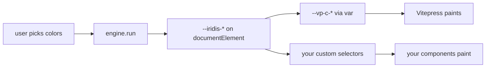

# Cascading tokens

This site is iridis dogfooded. Every chrome and syntax color you see, the page background, the body text, the sidebar dividers, the keywords in code blocks, the brand wash on the wordmark, comes out of the same `engine.run()` call you'd use in your own app. Pick palette colors in the right panel; the page recomputes in one paint.

The pattern is three layers: **engine emits CSS variables → CSS variables cascade into your framework's chrome → your framework paints**. None of the pieces depend on each other beyond names. Swap the framework, the engine, or the role schema and the rest still works.

## The shape



Three things happen, in order:

1. **Engine pass.** A reactive watcher fires on every `configStore` mutation. It runs the iridis pipeline against the user's seed colors and the user's selected role schema. Output is a `PaletteState` keyed by role name.
2. **Token write.** A small mapper translates the resolved roles to your CSS variable names and writes them onto `documentElement.style`. This is where you *name-alias*, the engine doesn't know your tokens are called `--iridis-brand` or `--my-app-accent`; you map them.
3. **Framework cascade.** Your existing CSS reads those variables. Vitepress's `--vp-c-bg`, `--vp-c-brand-1`, etc. become `var(--iridis-background)`, `var(--iridis-brand)`. Now Vitepress paints with iridis-derived colors without knowing iridis exists.

The engine doesn't import the framework. The framework doesn't import the engine. They share **a contract of variable names**.

## 1. The engine pass

Set up a singleton engine. Register the math + tasks once, define your pipeline, then call `run()` on every config change. This is the same code any consumer would write, it isn't site-specific.

```ts
import { Engine, mathBuiltins, coreTasks } from '@studnicky/iridis';

const engine = new Engine();
for (const m of mathBuiltins) engine.math.register(m);
for (const t of coreTasks)    engine.tasks.register(t);
engine.pipeline([
  'intake:hex',
  'resolve:roles',
  'expand:family',
  'enforce:contrast',
]);

const state = await engine.run({
  'colors':   userPalette,         // ['#7c3aed', '#06b6d4', ...]
  'roles':    userRoleSchema,      // RoleSchemaInterface
  'contrast': { 'level': 'AA', 'algorithm': 'wcag21' },
  'runtime':  { 'framing': 'dark', 'colorSpace': 'srgb' },
});

// state.roles is a Record<string, ColorRecord>
//   keyed by whatever role names your schema declared.
```

`state.roles` is the only thing the next layer cares about. Whatever your schema named its roles is what you'll find here.

## 2. The token write

This is the layer that varies per consumer. Decide what tokens your app exposes and write them. The mapper here uses **first-match aliases** so the same writer works for any role schema, `minimal`, `w3c`, `material`, or your own.

```ts
type RoleMap = Readonly<Record<string, ColorRecord>>;

function pick(roles: RoleMap, candidates: readonly string[]): ColorRecord | undefined {
  for (const name of candidates) {
    const r = roles[name];
    if (r !== undefined) return r;
  }
  return undefined;
}

const root = document.documentElement;

// Chrome, alias chains. The first declared role name that exists wins.
const background = pick(state.roles, ['background', 'canvas', 'base', 'bg']);
const surface    = pick(state.roles, ['surface', 'bgSoft', 'card', 'sheet'])      ?? background;
const text       = pick(state.roles, ['text', 'foreground', 'body', 'onBackground']);
const brand      = pick(state.roles, ['brand', 'accent', 'primary', 'keyword']);
const onBrand    = pick(state.roles, ['onBrand', 'onAccent', 'onPrimary']);

if (background) root.style.setProperty('--iridis-background', background.hex);
if (surface)    root.style.setProperty('--iridis-surface',    surface.hex);
if (text)       root.style.setProperty('--iridis-text',       text.hex);
if (brand)      root.style.setProperty('--iridis-brand',      brand.hex);
if (onBrand)    root.style.setProperty('--iridis-on-brand',   onBrand.hex);
```

The alias chain is the contract. **A role schema that uses `canvas`/`surface`/`text` works as cleanly as one that uses `bg`/`card`/`body`**, neither schema needs to know what the consumer's tokens are called.

When a role isn't found, leave the existing CSS value in place. Define safe fallbacks at the `:root` level (next layer) and the page never goes blank during the brief window before the engine resolves.

## 3. The framework cascade

This is the layer your existing stylesheet already does. You already have `--vp-c-bg`, `--my-app-bg`, `--mui-palette-background-default`, whatever. Replace the literal hex values with `var()` references to your iridis tokens.

```css
:root {
  /* Fallback values, used during the brief window before the engine
     writes its tokens, and during SSR. Pick reasonable defaults that
     match your dark/light framing. */
  --iridis-background: #07060f;
  --iridis-surface:    #0f0d1c;
  --iridis-text:       #f0f0ff;
  --iridis-brand:      #7c3aed;
  --iridis-on-brand:   #ffffff;

  /* Vitepress chrome cascades from iridis. */
  --vp-c-bg:        var(--iridis-background);
  --vp-c-bg-soft:   var(--iridis-surface);
  --vp-c-text-1:    var(--iridis-text);
  --vp-c-brand-1:   var(--iridis-brand);

  /* Derive softer / harder variants via color-mix instead of asking
     the engine for them. The engine's job is to satisfy roles, not to
     produce visual variants, you compose those at the framework layer. */
  --vp-c-brand-soft:
    color-mix(in oklch, var(--iridis-brand) 14%, transparent 86%);
  --vp-c-brand-hover:
    color-mix(in oklch, var(--iridis-brand) 88%, var(--iridis-text) 12%);
}
```

The fallback values are non-negotiable: they cover SSR (no `document`), the pre-hydration paint, and any error path where the engine can't resolve. Pick values that look correct standalone; the engine writes over them once it runs.

## Putting it together

```ts
// applyConfigToDocument.ts, the entire glue layer

import { Engine, mathBuiltins, coreTasks } from '@studnicky/iridis';
import { configStore } from './store';
import { roleSchemaByName } from './schemas';

const engine = new Engine();
for (const m of mathBuiltins) engine.math.register(m);
for (const t of coreTasks)    engine.tasks.register(t);
engine.pipeline(['intake:hex', 'resolve:roles', 'expand:family', 'enforce:contrast']);

export async function applyConfigToDocument(): Promise<void> {
  if (typeof document === 'undefined') return;

  const schema = roleSchemaByName[configStore.roleSchema];
  const state = await engine.run({
    'colors':   configStore.paletteColors,
    'roles':    schema,
    'contrast': { 'level': configStore.contrastLevel, 'algorithm': 'wcag21' },
    'runtime':  { 'framing': configStore.framing, 'colorSpace': 'srgb' },
  });

  const r = state.roles;
  const root = document.documentElement;
  const set = (name: string, value: string | undefined) => {
    if (value !== undefined) root.style.setProperty(name, value);
  };

  set('--iridis-background', r['background']?.hex ?? r['canvas']?.hex);
  set('--iridis-surface',    r['surface']?.hex    ?? r['bgSoft']?.hex);
  set('--iridis-text',       r['text']?.hex       ?? r['foreground']?.hex);
  set('--iridis-brand',      r['brand']?.hex      ?? r['accent']?.hex ?? r['primary']?.hex);
  set('--iridis-on-brand',   r['onBrand']?.hex    ?? r['onAccent']?.hex);
}
```

Mount it once in your framework's startup (Vue's `enhanceApp`, React's `useEffect` at the root, Solid's `onMount`):

```ts
// One-time setup + reactive re-run on store changes.
applyConfigToDocument();
watch(() => ({ ...configStore }), applyConfigToDocument, { 'deep': true });
```

That's the entire dogfood loop. The engine runs in your renderer. The tokens land on `:root`. Every `var()` in your stylesheet sees the new values in the next paint.

## Why aliases over hard role names

Role schemas evolve. You ship `minimal` today; six months later a customer wants Material's role naming and you don't want to break the consumer code that already maps `accent` → `--my-app-brand`. The alias chain absorbs the rename:

```ts
const brand = pick(state.roles, ['brand', 'accent', 'primary', 'keyword']);
```

Now any of those four names will fill `--my-app-brand`. The user's schema can declare whichever it prefers; your token cascade doesn't care.

This is the same reason the framework cascade uses `var()` instead of recomputed hex values: **decouple the role layer from the chrome layer**. Roles are about accessibility and intent; chrome is about visual identity. They overlap most of the time, but you never want them coupled at the source level.

## Re-rendering on framing changes

Framing (dark / light) is part of the engine input. When the user toggles the OS / appearance switch, update `configStore.framing` and the watcher fires another `engine.run()`. The role envelopes change (e.g. `background` jumps from `[0.92, 1.0]` lightness to `[0.0, 0.12]`); the contrast pairs re-enforce; the new tokens land. No second stylesheet, no `[data-theme="dark"]` selectors, one engine pass, one set of variables, two outputs.

The same applies to **contrast level**, **algorithm**, and **role schema**. All four are reactive inputs. All four trigger a re-resolve. The page paints the result.

## Scaling beyond chrome

The same alias-mapping pattern handles syntax tokens, chart colors, status colors, anything you ship as a CSS variable. The right-panel demo on this site maps fourteen syntax-* tokens (keyword, string, number, type, function, ...) by alias to the same resolved roles. Your code blocks recolor when the user picks a new palette without you authoring a separate "syntax theme".

```ts
const syntaxAliases = {
  'keyword': ['syntaxKeyword', 'keyword', 'brand',   'accent'],
  'string':  ['syntaxString',  'string',  'success', 'positive'],
  'number':  ['syntaxNumber',  'number',  'constant'],
  'comment': ['syntaxComment', 'comment', 'muted',   'secondary'],
  // ...
};

for (const [token, aliases] of Object.entries(syntaxAliases)) {
  const role = pick(state.roles, aliases);
  if (role) root.style.setProperty(`--my-syntax-${token}`, role.hex);
}
```

The schema doesn't have to declare syntax roles. If the user picks `minimal` (which has only `background / foreground / accent / muted`), `keyword` falls through to `brand`, `comment` falls through to `muted`, `string` falls through to `success`, and if `success` doesn't exist, you set a fallback in the `:root` block and that paints.

## Recap

- **Engine in the browser.** Same `engine.run()` your app uses. No special site flag.
- **Tokens are the contract.** Engine doesn't know your CSS; CSS doesn't know your engine.
- **Aliases over hard role names.** The role schema and the chrome cascade evolve independently.
- **Fallbacks at `:root`.** SSR, pre-hydration, and error paths all paint.
- **Reactivity is yours.** A watcher on the config store re-runs the engine. The CSS cascade does the rest.

Ready to wire this up in your project? Start from `getting-started`, drop the engine into your renderer, then mirror this page's `applyConfigToDocument` pattern. The full source for the docs site lives at [github.com/Studnicky/iridis](https://github.com/Studnicky/iridis) under `docs/.vitepress/theme/`.
